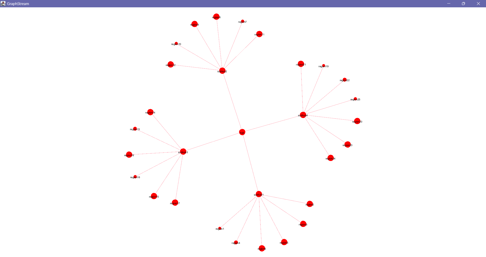

# VirusLand

This project was developed as part of a university subject. VirusLand is a
simulation program that models the spread of viruses across different regions.
It allows for the introduction of vaccines, the confinement of regions, and the 
closure of movement between regions. The simulation provides various options to
manipulate the spread and observe the effects over time.

## Getting Started

### Running the Project

1. Clone the repository:
    ```sh
    git clone https://github.com/guillemdiaz/Virusland.git
    ```
2. 
3. Open the project in your IDE.

3. Ensure that your `src`, `test`, and `res` directories are correctly set
   up as shown above.

4. To run the project, execute the `Main` class. You can do this by
   right-clicking the `Main.java` file in your IDE and selecting "Run".

### Program Usage

When the program starts, it will automatically load the files from the `res`
directory.

You will be prompted to choose the files for regions, viruses, vaccines, and
the initial state.

### Visualization with GraphStream

VirusLand uses GraphStream to visualize the regions and their connections. Each region is represented as a node, and connections between regions are represented as edges. The nodes grow in size based on the number of infected people in each region, providing a visual representation of the spread of the virus.

### Options

After loading the files, you will be presented with a menu of options (m to show
the menu):

0. End
1. Introduce vaccine to regions
2. Close flow of people between two regions
3. Open flow of people between two regions
4. Confine a region
5. Release a region
6. Simulate 1 step
7. Simulate n steps
8. Show current step information
9. Show total information

## Example of Execution

```text
Enter the folder name containing the files:
res4
Processing files in folder: res\res4
Regions loaded
Vaccines loaded
Viruses loaded
Initial state loaded


********************* OPTIONS ************************
* 1. Introduce vaccine to regions                    *
* 2. Close flow of people between two regions        *
* 3. Open flow of people between two regions         *
* 4. Confine a region                                *
* 5. Release a region                                *
* 6. Simulate 1 step                                 *
* 7. Simulate n steps                                *
* 8. Show current step information                   *
* 9. Show total information                          *
* m. Show Options                                    *
*                                                    *
* 0. End                                             *
******************************************************
Option: 7
Number of steps to simulate: 10
Option: 9
Total information:
******************************************************
TOTALS FOR REGION SUBHUB1 FOR THE VIRUS VIRUSB
******************************************************
* Simulation step                                 10 *
* Number of inhabitants                       286480 *
* Number of infected                         1540848 *
* Number of contagious                            29 *
* Number of sick                             1059902 *
* Number of immune                                 0 *
* Number of deaths                            438530 *
* Number of vaccinated                             0 *
* Transmission rate                             0.0% *
* Mortality rate                               0.28% *
******************************************************

******************************************************
TOTALS FOR REGION SUBHUB4 FOR THE VIRUS VIRUSB
******************************************************
* Simulation step                                 10 *
* Number of inhabitants                       -33514 *
* Number of infected                         1880764 *
* Number of contagious                            59 *
* Number of sick                             1320928 *
* Number of immune                                 0 *
* Number of deaths                            562447 *
* Number of vaccinated                             0 *
* Transmission rate                             0.0% *
* Mortality rate                                0.3% *
******************************************************

******************************************************
TOTALS FOR REGION REGION20 FOR THE VIRUS VIRUSA
******************************************************
* Simulation step                                 10 *
* Number of inhabitants                      2144088 *
* Number of infected                          299697 *
* Number of contagious                           775 *
* Number of sick                              236956 *
* Number of immune                                 0 *
* Number of deaths                             96820 *
* Number of vaccinated                             0 *
* Transmission rate                            0.01% *
* Mortality rate                               0.32% *
******************************************************

******************************************************
TOTALS FOR REGION REGION11 FOR THE VIRUS VIRUSA
******************************************************
* Simulation step                                 10 *
* Number of inhabitants                       107636 *
* Number of infected                          196249 *
* Number of contagious                           775 *
* Number of sick                              162700 *
* Number of immune                                 0 *
* Number of deaths                             73114 *
* Number of vaccinated                             0 *
* Transmission rate                            0.02% *
* Mortality rate                               0.37% *
******************************************************

******************************************************
TOTALS FOR REGION REGION1 FOR THE VIRUS VIRUSC
******************************************************
* Simulation step                                 10 *
* Number of inhabitants                      2127873 *
* Number of infected                            5233 *
* Number of contagious                             0 *
* Number of sick                                4743 *
* Number of immune                                 0 *
* Number of deaths                              2917 *
* Number of vaccinated                             0 *
* Transmission rate                             0.0% *
* Mortality rate                               0.56% *
******************************************************

...
````
## Unit Tests

Unit tests are located in the `test/java` directory. These include tests for 
the `Pair`, `Region`, `Simulator`, `Virus`, `VirusRNA`, and `VirusDNA` classes.

To run the tests, right-click on the test directory or individual test files 
and select "Run".

## File Formats

- The initial state file specifies the initial infection states of the regions.
- The regions file specifies the regions, their populations, and mobility.
- The viruses file specifies the virus families and individual viruses.
- The vaccines file specifies the available vaccines and their properties.

## Documentation

The source code is commented in a manner compatible with Doxygen. You can 
generate the documentation by running Doxygen on the provided configuration file.

### Generating Documentation with Doxygen

1. Install Doxygen from here.
2. In the root directory of the project, run the following command:
```text
doxygen Doxyfile
```
3. Open the generated index.html file in the html directory to view the 
   documentation.

## Visualization with GraphStream

VirusLand uses GraphStream to visualize the regions and their connections. 
Each region is represented as a node, and connections between regions are 
represented as edges. The nodes grow in size based on the number of infected 
people in each region, providing a visual representation of the spread of the virus.

### Example Graph Visualization

The following image shows the graph visualization after 10 simulation steps using data from the `res4` directory.



## License

This project is licensed under the MIT License - see the [LICENSE](LICENSE) 
file for details.
